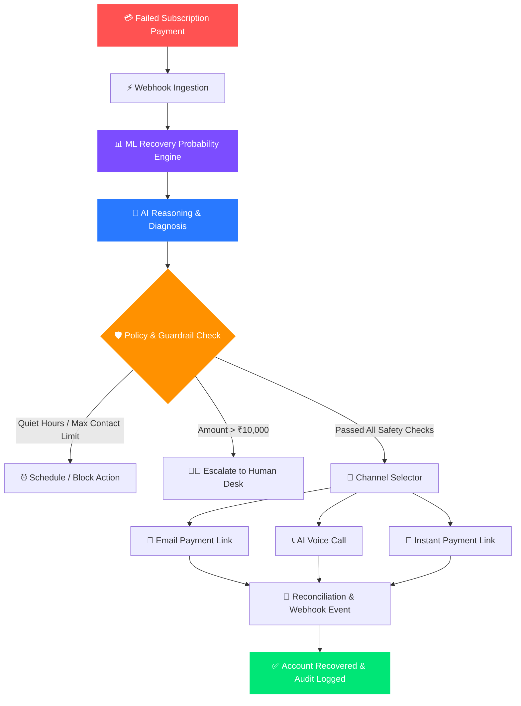

<div align="center">

# ⚡ REVORA
### Autonomous AI Revenue Recovery Platform

*Turning involuntary subscription payment failures into recovered revenue—intelligently, ethically, and autonomously.*

[](https://vercel.com)
[](https://render.com)
[](https://fastapi.tiangolo.com)
[](https://react.dev)
[](https://vitejs.dev)
[](https://tailwindcss.com)
[](https://python.org)
[](https://razorpay.com)

---

[Key Features](#-key-features) • [Workflow](#-autonomous-workflow) • [Demo Scenarios](#-demo-scenarios) • [Architecture](#-system-architecture) • [Tech Stack](#-technology-stack) • [Deployment](#-deployment-guide) • [API Docs](#-api-endpoints-summary)

</div>

---

## 💡 Overview

**Revora** is an enterprise-grade AI revenue recovery platform built for **Razorpay Hackathon (Track 03: AI Revenue Recovery)**. 

When a recurring subscription payment fails, merchants lose up to **9-15% of ARR to involuntary churn**. Traditional dunning sends generic spam emails or immediate retries, leading to customer frustration and low recovery rates.

Revora solves this by using an **Autonomous Agentic Loop** (`Observe ➔ Predict ➔ Reason ➔ Plan ➔ Act ➔ Audit`):
1. **Predicts** payment recovery probability using machine learning.
2. **Reasons** over failure root causes (e.g. insufficient funds vs expired card).
3. **Applies Policy & Financial Safety Guardrails** (quiet hours, promise-to-pay, contact frequency caps).
4. **Executes** personalized multi-channel outreach (Payment Links, AI Voice Calls, Email, Escalations).
5. **Logs** full end-to-end audit trails for complete compliance and transparency.

---

## 🔄 Autonomous Workflow



---

## ✨ Key Features

| Feature Category | Description | Key Capabilities |
| :--- | :--- | :--- |
| **🤖 Autonomous AI Engine** | Multi-agent reasoning for recovery decisions | • ML probability scoring (Scikit-Learn)<br>• Root cause diagnosis<br>• Dynamic channel selection |
| **🛡️ Financial Safety Guardrails** | Strict hard boundaries for AI autonomy | • Hard limit: Max ₹10,000 automated recovery<br>• Minimum 70% AI confidence threshold<br>• Idempotency key protection |
| **⚖️ Policy & Compliance Engine** | Ethical outreach & customer respect | • **Quiet Hours Enforcement** (22:00 - 08:00)<br>• **Promise-to-Pay** pause mechanism<br>• Frequency cap: Max 3 contacts / 72 hrs |
| **📞 Multi-Channel Outreach** | Personalized recovery touchpoints | • Smart Razorpay payment link generation<br>• Interactive AI voice call simulation<br>• Human desk escalation for high-value cases |
| **💳 Gateway Health & Failover** | Resilience against gateway downtime | • Automatic health monitoring<br>• Adaptive fallback to backup gateways |
| **📊 Audit & Observability** | Complete visual dashboard & logs | • Real-time revenue at risk tracking<br>• Interactive recovery funnel charts<br>• Full timeline audit trails |

---

## 🎯 Demo Scenarios

Revora includes 5 pre-seeded production scenarios to test all capabilities in Demo Mode (`DEMO_MODE=true`):

| Customer Name | Amount | Scenario / Trigger | Outcome / Behavior |
| :--- | :--- | :--- | :--- |
| **Rahul Sharma** | ₹4,999 | Primary recovery demo (87% recovery probability) | AI selects **Payment Link via Email**. Immediate recovery. |
| **Amit Verma** | ₹35,000 | High-Value Escalation (Exceeds ₹10k guardrail limit) | **Automated recovery blocked**. Escalated to Human Desk. |
| **Neha Singh** | ₹4,999 | Customer commitments (**Promise-to-Pay**) | Outreach **paused** until promised payment date. |
| **Rohit Mehta** | ₹4,499 | Failed at 11:30 PM (**Quiet Hours Violation**) | Outreach **blocked**. Rescheduled for 08:00 AM. |
| **Gateway Demo** | — | Paytm Gateway Outage Simulation | Automatically **fails over to Razorpay Backup**. |

---

## 🏗️ System Architecture

```
                 ┌──────────────────────────────────────┐
                 │       React 18 + Vite Frontend       │
                 │      (Tailwind CSS + Recharts)       │
                 └──────────────────┬───────────────────┘
                                    │ HTTP / REST
                                    ▼
                 ┌──────────────────────────────────────┐
                 │          FastAPI Backend API         │
                 └──────────────────┬───────────────────┘
                                    │
    ┌───────────────────────────────┼───────────────────────────────┐
    ▼                               ▼                               ▼
┌─────────────────┐       ┌─────────────────┐       ┌─────────────────┐
│ ML Predictor    │       │ AI Reasoning    │       │ Policy & Safety │
│ (Scikit-Learn)  │       │ (Diagnosis)     │       │ Guardrails      │
└────────┬────────┘       └────────┬────────┘       └────────┬────────┘
         │                         │                         │
         └─────────────────────────┼─────────────────────────┘
                                   │
                                   ▼
                 ┌──────────────────────────────────────┐
                 │          Providers Layer             │
                 │  (Razorpay / Email / Voice / Gateway)│
                 └──────────────────┬───────────────────┘
                                    │
                                    ▼
                 ┌──────────────────────────────────────┐
                 │         PostgreSQL / SQLite          │
                 │      (SQLAlchemy 2.0 ORM Engine)     │
                 └──────────────────────────────────────┘
```

---

## 💻 Technology Stack

### **Frontend**
- **Framework**: React 18 with Vite
- **Styling**: Tailwind CSS
- **Visualization**: Recharts
- **Icons**: Lucide React
- **HTTP Client**: Axios & Fetch API
- **Deployment**: Vercel

### **Backend**
- **API Framework**: FastAPI (Python 3.11+)
- **ORM & Database**: SQLAlchemy 2.0 (PostgreSQL / SQLite)
- **Settings & Validation**: Pydantic v2
- **ML Engine**: Scikit-Learn (Logistic Regression & Probability Calibration)
- **Deployment**: Render / Railway

---

## 🚀 Quick Start (Local Setup)

### 1. Repository Clone
```bash
git clone https://github.com/Aryan-Lade/Revora.git
cd Revora
```

### 2. Backend Setup
```bash
cd backend
cp .env.example .env
python -m venv venv

# Windows
venv\Scripts\activate
# Linux/Mac
source venv/bin/activate

pip install -r requirements.txt
uvicorn app.main:app --reload --port 8000
```
> Backend runs at: `http://localhost:8000` (API Docs at `http://localhost:8000/docs`)

### 3. Frontend Setup
```bash
cd ../Frontend
cp .env.example .env
npm install
npm run dev
```
> Frontend runs at: `http://localhost:5173`

---

## 🌐 Deployment Guide

### Deploying Frontend on Vercel
1. Import repository on **[Vercel](https://vercel.com)**.
2. Set **Root Directory** to `Frontend`.
3. Set **Framework Preset** to `Vite`.
4. Add Environment Variable:
   - `VITE_API_BASE_URL` = `https://your-backend-url.onrender.com`
5. Click **Deploy**.

### Deploying Backend on Render
1. Create a new **Web Service** on **[Render](https://render.com)**.
2. Connect `Aryan-Lade/Revora` repository.
3. Set **Root Directory** to `backend`.
4. Set **Build Command**: `pip install -r requirements.txt`
5. Set **Start Command**: `uvicorn app.main:app --host 0.0.0.0 --port $PORT`
6. Add Environment Variables:
   - `DEMO_MODE` = `true`
   - `ENVIRONMENT` = `production`
   - `FRONTEND_URL` = `https://your-app.vercel.app`

---

## 🔌 API Endpoints Summary

| Method | Endpoint | Description |
| :--- | :--- | :--- |
| `GET` | `/api/health` | Health check & system status |
| `GET` | `/api/dashboard/overview` | High-level metrics & recovery stats |
| `GET` | `/api/recovery/cases` | Priority queue of active recovery cases |
| `POST` | `/api/recovery/{id}/execute` | Execute recommended recovery action |
| `POST` | `/api/recovery/{id}/escalate` | Escalate case to human recovery desk |
| `POST` | `/api/recovery/{id}/promise-to-pay` | Register a promise-to-pay commitment |
| `GET` | `/api/voice/sessions` | Voice session logs & transcripts |
| `POST` | `/api/webhooks/razorpay` | Razorpay webhook event listener |

---

## 🤝 License & Acknowledgments

Built with ❤️ for **Razorpay Hackathon 2026**. Special thanks to Razorpay for powering India's financial ecosystem!